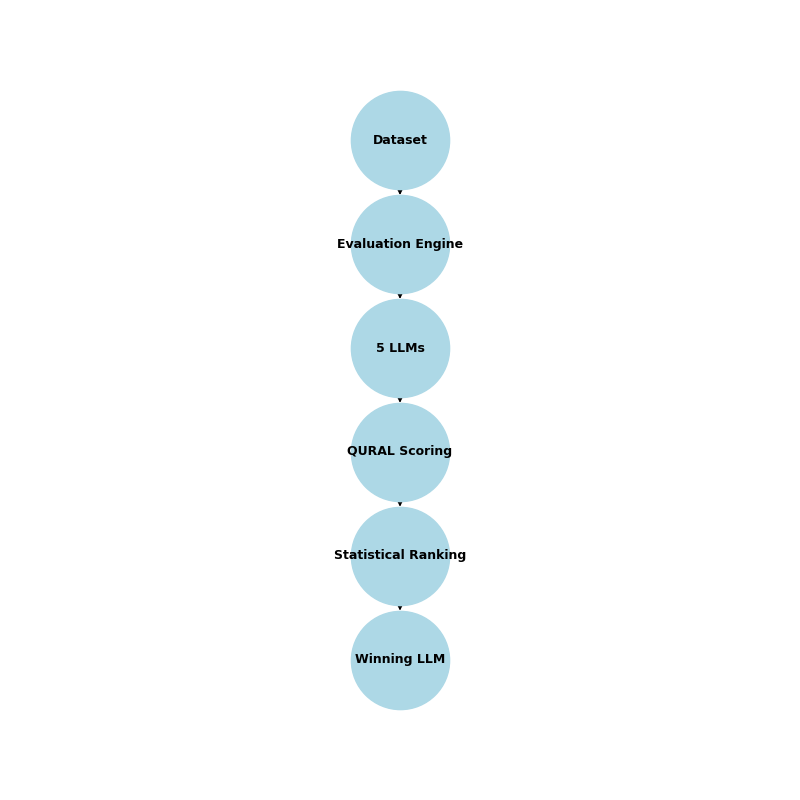
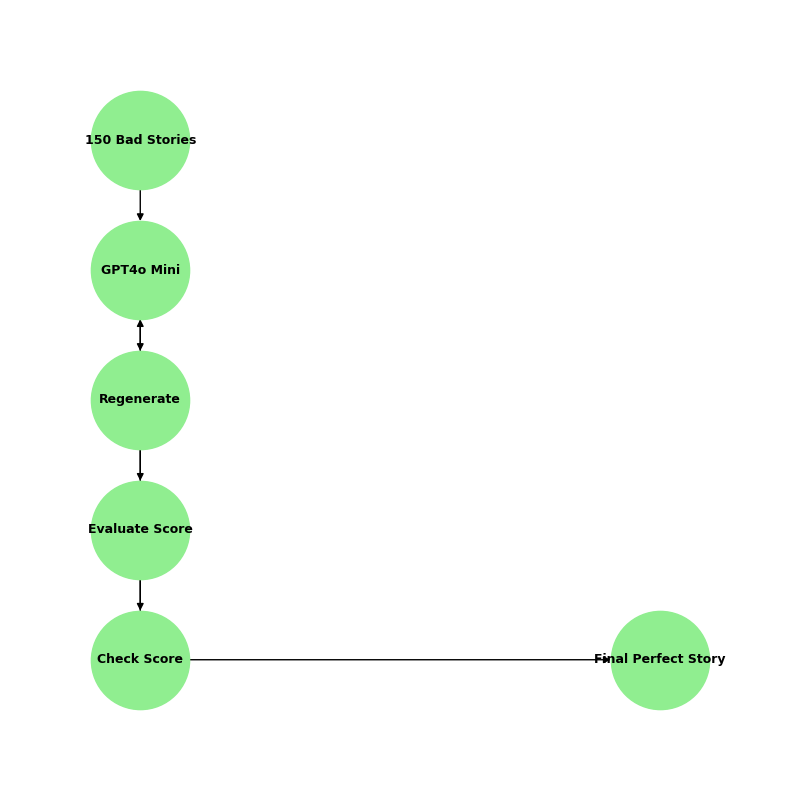
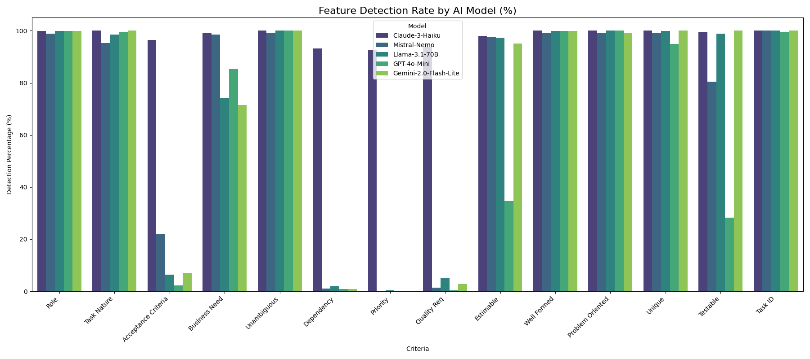
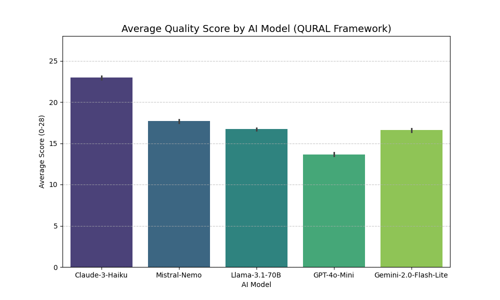
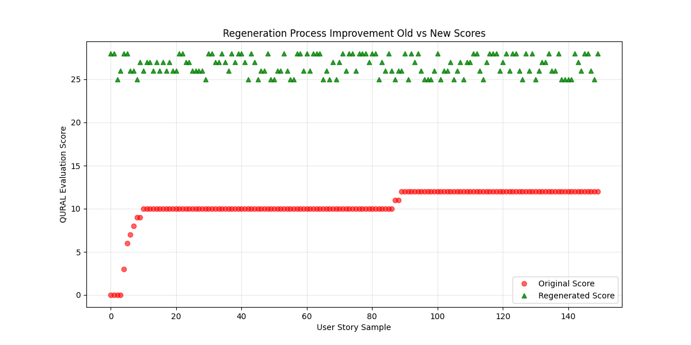

# QURAL: Automated Quality Evaluation and Iterative Regeneration of User Stories


**Lead Developer & System Architect:** Abdul Qadeer  
**Framework:** QURAL (Quality User Story Analysis Framework)

---

## 🚀 System Overview

This repository contains the full technical implementation of the **QURAL (Quality User Story Analysis Framework)**. The system utilizes Large Language Models (LLMs) to perform automated quality auditing, cross-model statistical ranking, and iterative self-correction of Agile requirements.

The objective of this project is to automate the quality assurance process for Agile User Stories across 15 diverse project datasets. By leveraging a multi-model pipeline, the system identifies structural deficiencies in requirements and employs a self-correcting feedback loop to regenerate stories that adhere to strict quality standards.

---

## 🏗 System Architecture

The project is engineered in two primary phases designed to ensure robustness and scalability.

### Phase 1: Evaluation & Ranking
The system processes **550 User Stories** through five state-of-the-art LLMs:
- GPT-4o Mini
- Claude 3 Haiku
- Llama 3.1 70B
- Mistral Nemo
- Gemini 2.0 Flash Lite

The pipeline extracts **14 specific semantic elements** and assigns quality scores based on the QURAL framework.


*> Figure 1: High-level architecture of the evaluation and ranking pipeline.*

### Phase 2: Iterative Regeneration
Defective stories (identified as the bottom 150 performers) are fed into a self-correcting loop. The highest-ranked model acts as both generator and judge, iterating on the text until the quality threshold is satisfied.


*> Figure 2: Flowchart depicting the iterative regeneration feedback loop.*

---

## 📊 Analytics & Visualizations

### 1. Structural Element Detection
Visual analysis of how different LLMs identify the 14 QURAL elements. This chart highlights common omissions in human-written stories, such as **Priority** and **Dependency**.



### 2. LLM Performance Benchmarking
A comparative study of average scoring trends, identifying the variance between strict auditing models and more lenient contextual models.



### 3. Regeneration Success Rate
A scatter plot demonstrating the "Before vs. After" state of the 150 defective stories processed. It tracks the successful quality jump from human-authored drafts to AI-refined requirements.



---

## 📁 Repository Structure

| File | Description |
| :--- | :--- |
| `Master_QURAL_Analysis.xlsx` | The master dataset containing 550 stories and all LLM evaluations. |
| `Table_LLM_Rankings.csv` | Statistical ranking using weighted BERTScore, METEOR, and Consistency metrics. |
| `Iterative_Regeneration_Results.xlsx` | The execution log of the 150 stories processed through the iterative loop. |
| `Shortlisted_150_Bad_Stories.csv` | Clean dataset of the defective stories identified during Phase 1. |
| `Table_Semantic_Agreement.csv` | NLP analysis showing exact text extraction alignment between different models. |
| `Final_Project_Report.docx` | Comprehensive technical discussion and framework analysis. |
| `src/` | Source code for statistics, regeneration loops, and utilities. |
| `requirements.txt` | Python dependencies required to run the project. |

---

## 🧪 Methodology & Metrics

The system identifies the optimal "Judge" model using a weighted multi-metric formula to ensure statistical significance:

| Metric | Weight | Description |
| :--- | :--- | :--- |
| **BERTScore** | 40% | Semantic and contextual similarity. |
| **METEOR** | 30% | Translation fidelity and linguistic alignment. |
| **Consistency** | 30% | Spearman Rank Correlation for inter-rater reliability. |

**🏆 Winning Model:** GPT-4o Mini  
**Weighted Score:** 0.7649

---

## 🛠 Installation & Usage

### 1. Environment Setup

Ensure you have Python 3.8 or higher installed.

```bash
# Create virtual environment
python3 -m venv venv

# Activate environment
# On macOS/Linux:
source venv/bin/activate
# On Windows:
venv\Scripts\activate

# Install dependencies
pip install -r requirements.txt
```

### 2. Execution

Run the analysis and regeneration scripts from the root directory.

```bash
# Calculate advanced statistics and model rankings
python src/advanced_stats.py

# Execute the iterative regeneration loop
python src/regeneration_loop.py
```

### 3. Configuration

API keys for LLM providers should be configured in a `.env` file located in the root directory. Refer to `.env.example` for the required structure.

---

## 📄 License

This project is licensed under the MIT License - see the [LICENSE](LICENSE) file for details.

---

## 🤝 Contributing

Contributions, issues, and feature requests are welcome. Please feel free to check the [issues page](https://github.com/abdulqadeer/qural/issues) if you want to contribute.

---

## 📬 Contact

**Abdul Qadeer**  
*Full Stack AI Engineer and Researcher*

- 📧 Email: [itsabdulqadeer.55@gmail.com]
- 💼 LinkedIn: [[linkedin.com/in/abdulqadeer99](https://www.linkedin.com/in/abdulqadeer99/)]
- 🐙 GitHub: [github.com/abdulqadeer-55]

---

*Built with ❤️ by Abdul Qadeer*
